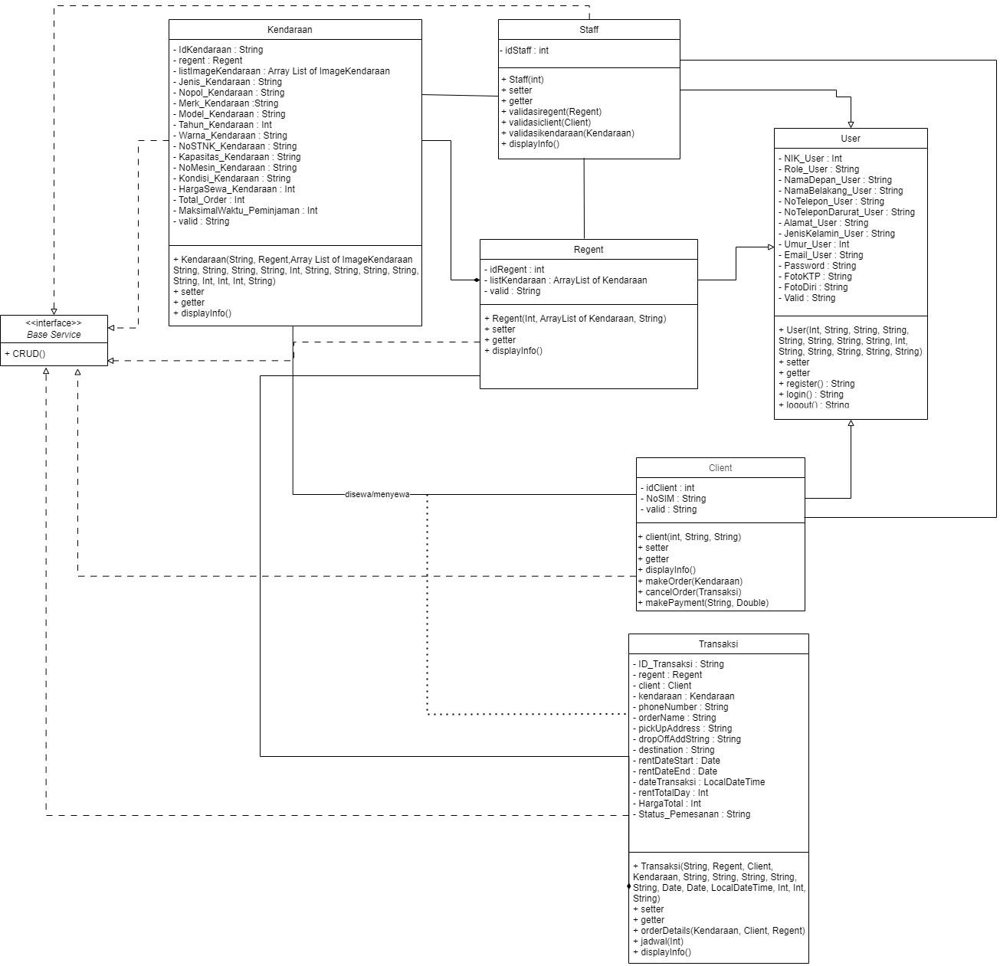

**Leading Vehicle Rental Solution**

Vehic Rent is a web-based online vehicle rental service that can be accessed anywhere and anytime. With Vehic Rent, users can survey the vehicle they want to rent without having to go to the rental place. Created by a groups of 6 from IF 45 09 consisting of.

    1. Abdul Wasiul Khair
    2. Raditya Aydin
    3. Siti Vanesa Rahma 
    4. Zefanya Darma Putri 


## Class Diagram


### Installation Steps
Pastikan untuk memiliki perangkat lunak berikut terpasang di lingkungan lokal Anda sebelum memulai:

- Java (versi 17)
1. **Clone the Repository**

    ```bash
    git clone https://github.com/Radiit/VehicRent.git
    ```

2. **Navigate to the Project Directory**

    ```bash
    cd your-project
    ```

3. **Creating a schema**

    After the installation is complete, create a mysql schema named tubesrpl. Or simply follow the jdbc url

- *application.properties*
```application.properties
spring.datasource.url=jdbc:mysql://localhost:3306/tubesrpl
```

4. **Run the Application**

    Once the installation is complete, run the application using the command:

    ```bash
    ./mvnw spring-boot:run
    ```

5. **Access the Application**

    Open a browser and access the application via the URL:

    ```http
    http://localhost:8081
    ```
